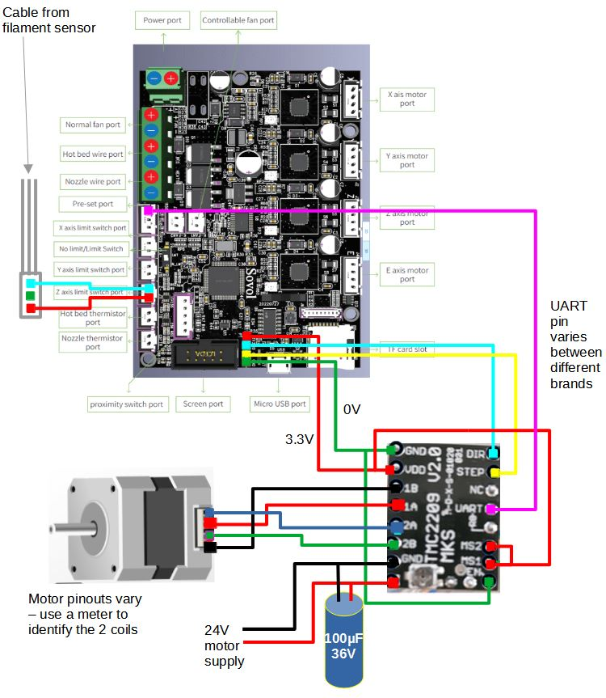

# Add-extra-stepper-to-STM32F103-32-bit-boards-including-Sovol-SV06

## How to add an extra stepper driver without soldering to mainboard, including full UART access.
** Use at your own risk **

# 
I recently bought a SV06 plus which like many printers has dual Z motors but only 4 drivers on the main board (X,Y,Z,E) and a Y shaped splitter cable driving both Z motors.
The printer uses one of the popular 'creality type' STFM32F103 boards, actually GD32F103 RET6. 

Link to board details and schematics here :
https://github.com/CrealityOfficial/E3-Free-runs-Silent-Motherboard which includes 4 TMC2209 drivers.

I wanted proper dual Z, had seen someone doing similar with an earlier board running the tmc driver in stand-alone mode   : 
https://www.reddit.com/r/ender3v2/comments/qzxsok/i_added_a_5th_stepper_driver_to_the_stock/

And someone else wiring the UART pins to the driver chips on a adifferent earlier board to give the onboard drivers full UART acces :
https://www.reddit.com/r/ender3v2/comments/n3clew/ender_3v2_422427_board_tmc_uart_mods/

The 4 pin header in front of the display connector include 2 pins which can drive the step and direction inputs, so the next thing was to find an output for the UART which can set various parameters on the motor driver and read status messages, errors such as overtemperature etc.  I initially hoped to use some of the X Y & Z limit pins which on the Sovol are empty & unused because of sensorless homing, but these pin names seem to be still needed in the Klipper config to route the diag_pin stall signal from the drivers.

After investigation of the board schematics I found there is a pin assigned to X+ limit switch which is UART-capable :  

And this pin is broken out onto the +X limit switch 3 pin socket which on the SV06+ is the input for the filament sensor.  The relevant part of the schematic is here :

To restore the filament runout sensor I routed this to the Z limit inputs, since stallguard isn't active on the Z axis and Z endstop is done via the bed level sensor so that pin is genuinely empty.  The filament sensor is just a microswitch between the two outer pins on the plug which closes when filament is present, so is compatible with the Z switch input.

# Wiring Diagram

Cautions : 
+ the pins on the header lead directly to the processor and ny errors could break your main board
+ different TMC boards are known to have the UART connection on diffreent pins with some jummpers on the rear to redirect them (discussion here : https://klipper.discourse.group/t/tmc-uart-wiring-and-pin-variations/11391) 
+ not all steppers motors have the same wiring, some have a crossed middle pair some don't - test with a meter
+ the 100uF capacitor should be close to the driver. Be sure to get it the right way around :)
  

# Physical Build and Installation

I built mine on a small piece of prototype board and reused an old stepper cable, one end to connect the Z1 motor and the other end to connect to the header near the display socket.  U hooked up the filament plug to the Z limit socket with dupont jumpers. It makes quite a nice self-contained add-on :

And is easily installed inside the mainboard case : 

