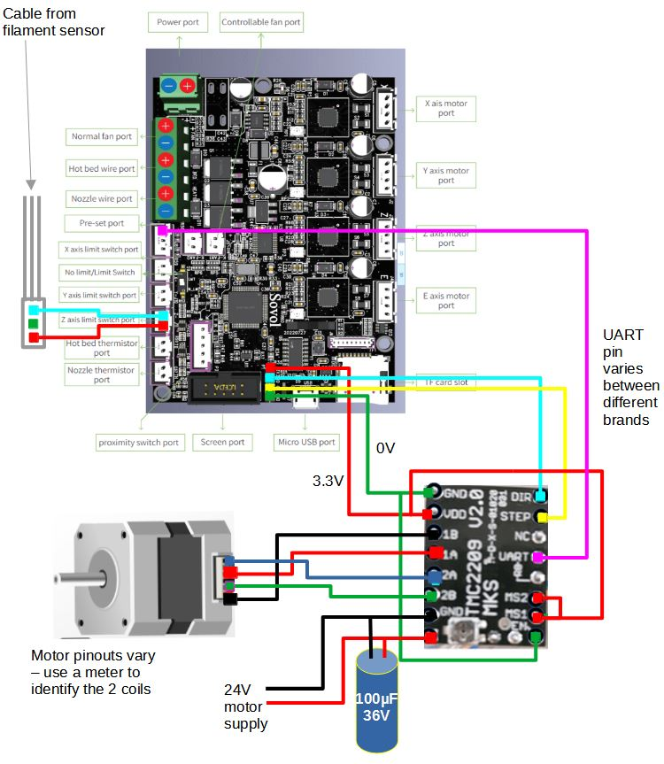

# Add-extra-stepper-to-STM32F103-32-bit-boards-including-Sovol-SV06
How to add an extra stepper driver without soldering to mainboard, including full UART access

# 
I bought a SV06 plus which like many printers has dual Z motors but only 4 drivers on the main board (X,Y,Z,E) and a Y shaped splitter cable driving both Z motors.
The printer uses one of the popular 'creality type' STFM32F103 boards, actually GD32F103 RET6.
Link to board details and schematics here :  https://github.com/CrealityOfficial/E3-Free-runs-Silent-Motherboard which includes 4 TMC2209 drivers.

I wanted proper dual Z, had seen someone doing similar with an earlier board running the tmc driver in stand-alone mode   : 
https://www.reddit.com/r/ender3v2/comments/qzxsok/i_added_a_5th_stepper_driver_to_the_stock/
And someone else wiring the UART pins to the driver chips on the board to give full UART acces :
https://www.reddit.com/r/ender3v2/comments/n3clew/ender_3v2_422427_board_tmc_uart_mods/

The 4 pin header in front of the display connector include 2 pins which can drive the step and direction inputs and after investigation of the board schematics I found there is a pin assigned to X+ limit switch which is UART-capable.  https://github.com/CrealityOfficial/E3-Free-runs-Silent-Motherboard

