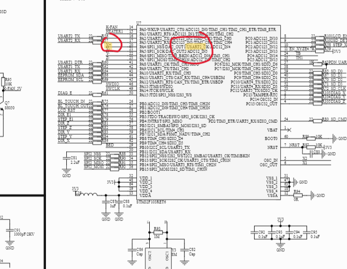
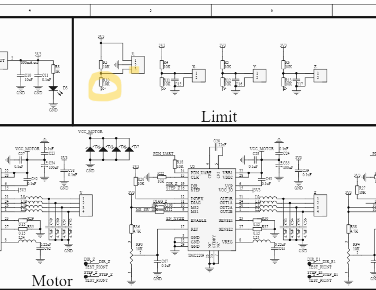
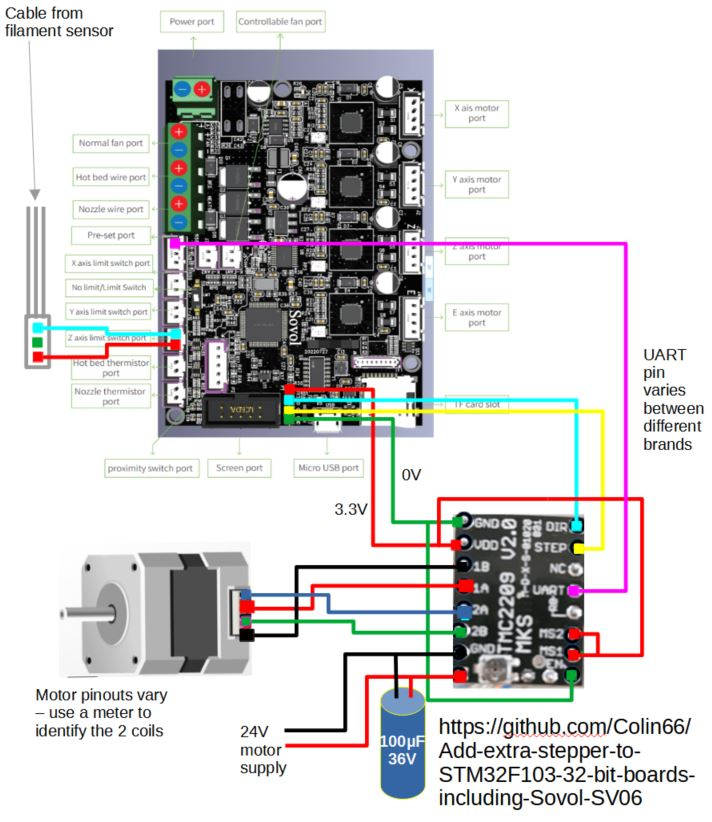
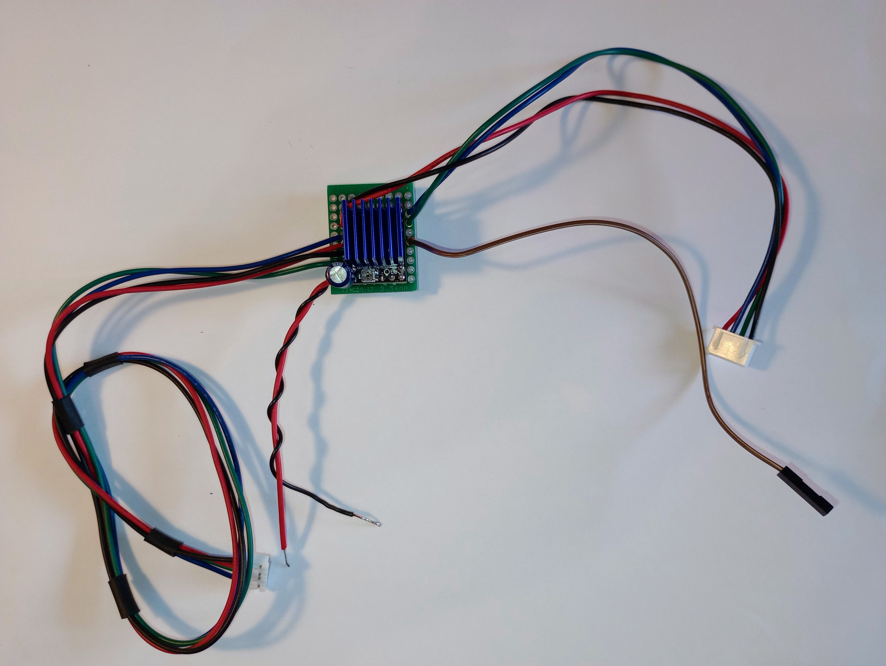
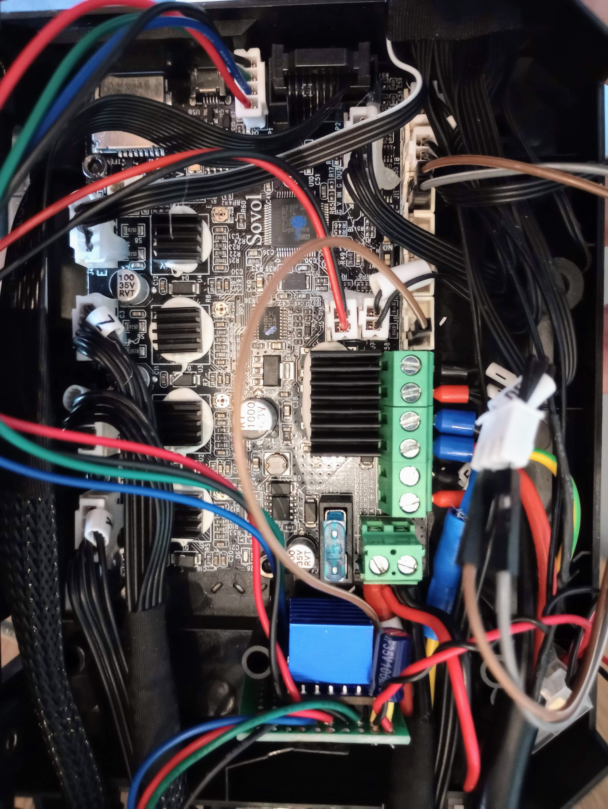

# Add-extra-stepper-to-STM32F103-32-bit-boards-including-Sovol-SV06

## How to add an extra stepper driver without soldering to mainboard, including full UART access.
** Use at your own risk **

# 
I recently bought a SV06 plus which like many printers has dual Z motors but only 4 drivers on the main board (X,Y,Z,E) and a Y shaped splitter cable driving both Z motors.
The printer uses one of the popular 'creality type' STFM32F103 boards, actually GD32F103 RET6. 

Link to board details and schematics here :
https://github.com/CrealityOfficial/E3-Free-runs-Silent-Motherboard which includes 4 TMC2209 drivers.

I wanted proper dual Z, had seen someone doing similar with an earlier board running the tmc driver in stand-alone mode   : 
https://www.reddit.com/r/ender3v2/comments/qzxsok/i_added_a_5th_stepper_driver_to_the_stock/

And someone else wiring the UART pins to the driver chips on a adifferent earlier board to give the onboard drivers full UART acces :
https://www.reddit.com/r/ender3v2/comments/n3clew/ender_3v2_422427_board_tmc_uart_mods/


The 4 pin header in front of the display connector include 2 pins which can drive the step and direction inputs, so the next thing was to find an output for the UART which can set various parameters on the motor driver and read status messages, errors such as overtemperature etc.  I initially hoped to use some of the X Y & Z limit pins which on the Sovol are empty & unused because of sensorless homing, but these pin names seem to be still needed in the Klipper config to route the diag_pin stall signal from the drivers.

After investigation of the board schematics I found there is a pin assigned to X+ limit switch which is UART-capable :  



And this pin is broken out onto the +X limit switch 3 pin socket which on the SV06+ is the input for the filament sensor.  The relevant part of the schematic is here :



To restore the filament runout sensor I routed this to the Z limit inputs, since stallguard isn't active on the Z axis and Z endstop is done via the bed level sensor so that pin is genuinely empty.  The filament sensor is just a microswitch between the two outer pins on the plug which closes when filament is present, so is compatible with the Z switch input.
The TMC documentation seems to say wiring MS1 & MS2 high aren't needed if using UART mode but I couldn't get it to run unless I did.

# Wiring Diagram

Cautions : 
+ the pins on the header lead directly to the processor and ny errors could break your main board
+ different TMC boards are known to have the UART connection on diffreent pins with some jummpers on the rear to redirect them (discussion here : https://klipper.discourse.group/t/tmc-uart-wiring-and-pin-variations/11391) 
+ not all steppers motors have the same wiring, some have a crossed middle pair some don't - test with a meter
+ the 100uF capacitor should be close to the driver. Be sure to get it the right way around :)
  



# Physical Build and Installation

I built mine on a small piece of prototype board and reused an old stepper cable, one end to connect the Z1 motor and the other end to connect to the header near the display socket.  I hooked up the filament plug to the Z limit socket with dupont jumpers. 
It makes quite a nice self-contained add-on and is easy to revert to stock :



It's compact and is easily installed inside the mainboard case : 



# Klipper Configuration

You may prefer different settings but here's what I did :

```
[stepper_z1]
step_pin: PA14
dir_pin: !PA13
enable_pin: !PC3
microsteps: 32 #128 #64 #128 # 32 # 256 CB
rotation_distance: 4
endstop_pin: probe:z_virtual_endstop

[tmc2209 stepper_z1]
uart_pin: PA4 #filament sensor seems to be uart capable ? # replace  other z diag pin - didn't work, looks like not uart capable  ? # Y endstop
run_current: 0.400  ##### I halved the run currents because we no longer have 2 motors in parallel
hold_current: 0.2   ##### stepper with new driver was getting warm, not sure why, lowered hold current
driver_PWM_AUTOGRAD: True
driver_PWM_AUTOSCALE: True
stealthchop_threshold: 9999999 #0 CB
interpolate: True #False
sense_resistor: 0.150
uart_address: 3

[stepper_z]
step_pin: PB6
dir_pin: !PB5
enable_pin: !PC3
microsteps: 32 #64 #128 #64 #128 # 32 # 256 CB
rotation_distance: 4
endstop_pin: probe:z_virtual_endstop
position_min: -0.5
position_max: 340 # NOTE You can adjust this if you have more room
homing_speed: 7

[tmc2209 stepper_z]
uart_pin: PA15
run_current: 0.4 #0.800   ##### I halved the run currents because we no longer have 2 motors in parallel
#hold_current: 0.2
stealthchop_threshold: 9999999 #0 CB
interpolate: True #False
sense_resistor: 0.150
uart_address: 3
#diag_pin: PA7

[gcode_macro G34]  # level z, home first if needed
gcode: 
 
        M118 Printer is already homed, levelling z..
        z_TILT_ADJUST
    
        M118 Home all axes then level Z..
        G28
        z_TILT_ADJUST
    

[z_tilt]
z_positions:   ###### these identify the pivot points, usually the middle of the Z leadscrews
  354, 170     ###### these are for my SV06 plus
  -51, 170
 points: 1, 170
        247, 170 
speed: 100
horizontal_move_z: 5
retries: 15
retry_tolerance: 0.01

[filament_switch_sensor filament_sensor]   
switch_pin: !PA7    #pa7 is reassigned z diag but z doesn't use sensorless so no loss  #PA4 reassigned to z1 uart
pause_on_runout: True
insert_gcode:
    { action_respond_info("Insert Detected") }
runout_gcode:
    { action_respond_info("Runout Detected") }
    CONDITIONAL_BEEP i=3 dur=300 freq=400

## ALSO : delete the mechanical_gantry_calibration.cfg file or change its name to something else ## 
```
Also you should delete the mechanical_gantry_calibration.cfg file or change its name to something else because it contains the g34 'crash the gantry into the top rail' alignment process which you don't want.

# Testing

Double & triple check wiring, use a multimeter to check for solder bridges etc..
Try DUMP_TMC STEPPER=stepper_z1 to see if the UART is communicating. 

### If your Z motors run out of sync or in different directions you'll damage your printer, so proceed slowly..

I'd recommend buzzing the motors first to check it's connected.
Then and try some small tentative Z movements after sending SET_KINEMATIC_POSITION (to avoid needing to home first). 
I found the motor with the new controller ran hot.  There are a million and one TMC settings which I assume need tuning but I don't know what they are.  If someone does, please let me know.

Klipper reference for Z-tilt is here :  https://www.klipper3d.org/Config_Reference.html#z_tilt

...And thats about it.  Good luck & enjoy.

